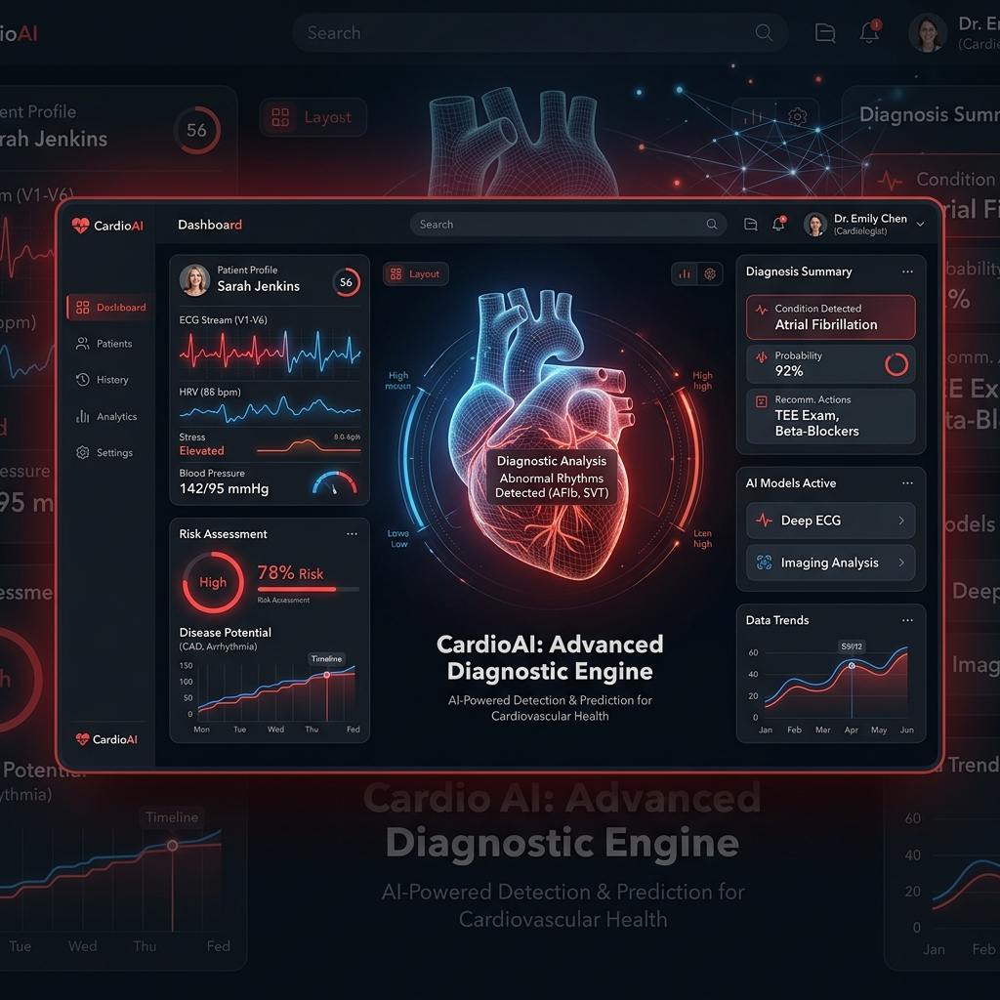
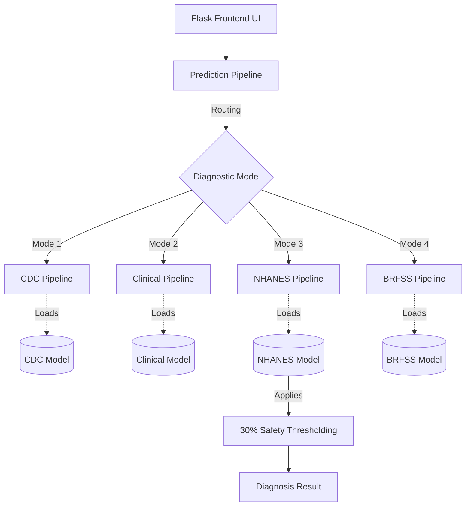

<div align="center">
  
  
  <h1>🩺 CardioAI: Quad-Core Diagnostic Engine</h1>
  <p><b>Enterprise-Grade Machine Learning for Cardiovascular Disease Prediction</b></p>
  <h3>🚀 Live Demo: <a href="https://cardio-ai-engine.onrender.com">cardio-ai-engine.onrender.com</a></h3>  
  [](https://python.org)
  [](https://flask.palletsprojects.com/)
  [](https://xgboost.readthedocs.io/)
  [](https://www.docker.com/)
  [](#)
</div>

---

## 🌟 Overview

CardioAI is a state-of-the-art Medical AI application integrating four distinct Machine Learning pipelines into a single, cohesive web interface. Engineered for both public health triage and advanced clinical diagnostics, it employs sophisticated data engineering (e.g., SMOTE) and aggressive threshold tuning to prioritize patient safety (Recall) over raw accuracy.

---

## 🚀 Key Features

*   **Quad-Core Architecture:** Seamlessly switches between 4 distinct diagnostic models depending on the data available.
*   **Deep Hyperparameter Grid Search:** Evaluated hundreds of combinations of Random Forest and XGBoost parameters to find the absolute mathematical peak of performance.
*   **Aggressive Safety Thresholding:** Overrode the default 50% Machine Learning confidence threshold, dropping it to 30% for advanced diagnostics to drastically increase sensitivity to heart attacks.
*   **Imbalanced Data Mastery (SMOTE):** Mathematically generated synthetic data for highly imbalanced datasets, ensuring the algorithm learns clinical patterns instead of majority-class guessing.

---

## 🧠 Diagnostic Modes

| Mode | Purpose | Accuracy | Recall | Key Features |
| :--- | :--- | :--- | :--- | :--- |
| **Mode 1: CDC** | Rapid public health triage | `90.21%` | - | High BP, Cholesterol, BMI, Smoker, Stroke, Diabetes |
| **Mode 2: Clinical** | Standard physical metrics | `73.77%` | - | BP, Height, Weight, Glucose/Cholesterol categories |
| **Mode 3: NHANES** | Advanced chemical bloodwork | `82.90%` | **`50.48%`** | Fasting Glucose, CRP, Total Cholesterol, WBC, HDL |
| **Mode 4: BRFSS** | Deep lifestyle & behavioral | `91.31%` | - | 40+ extensive behavioral/environmental metrics |

---

## 🏗️ Enterprise System Architecture



---

## 🌍 Dual Architecture Deployment (DADMP)

This project features a Dual Architecture Deployment pipeline designed for both maximum scale and self-hosted privacy. For detailed deployment instructions, refer to the [Enterprise Deployment Playbook](infra/cloud/DEPLOYMENT_GUIDE.md).

### Architecture 1: Cloud Native (Live Demo)
A zero-maintenance, fully managed environment running on **Render.com**.
*   **Infrastructure:** Serverless/PaaS managed deployment.
*   **Continuous Integration:** Auto-deploy triggered on GitHub commits.
*   **Best For:** Portfolio demonstrations, hackathons, and public health campaigns.

### Architecture 2: Self-Hosted Container (Docker)
A fully isolated, on-premise capable environment built with **Docker Compose** and **Nginx**.
*   **Infrastructure:** Virtual Private Server (VPS), EC2, or local bare metal.
*   **Networking:** Includes an Nginx reverse proxy and Gunicorn WSGI server.
*   **Best For:** Strict HIPAA/GDPR data compliance and private clinical deployment.

---

## 📂 Clean Project Structure

```text
📦 Cardiosense-ML
 ┣ 📂 config/           # Configuration files
 ┣ 📂 models/           # Compiled ML artifacts (.pkl files)
 ┣ 📂 scripts/          # Dataset processors & experiment scripts
 ┣ 📂 src/              # Core Machine Learning logic
 ┃ ┣ 📂 Heart/          # Heart disease package
 ┃ ┃ ┣ 📂 components/   # Ingestion, transformation, evaluation, training
 ┃ ┃ ┗ 📂 pipeline/     # Prediction & training pipelines
 ┣ 📂 static/           # CSS & Frontend Assets
 ┣ 📂 templates/        # HTML UI (Jinja2)
 ┣ 📂 tests/            # Validation & Metric scripts
 ┣ 📜 app.py            # Main Flask Application
 ┣ 📜 Makefile          # Enterprise deployment commands
 ┣ 📜 Dockerfile        # Containerization instructions
 ┣ 📜 requirements.txt  # Strict dependencies
 ┗ 📜 README.md         # You are here
```

---

## 🛠️ Installation & Usage

This project utilizes an enterprise `Makefile` for instant setup.

### Prerequisites
- Python 3.8+
- Git

### Local Execution

1. **Clone the repository:**
   ```bash
   git clone https://github.com/Shikhar-Kesharwani/Cardiosense-ML.git
   cd Cardiosense-ML
   ```

2. **Install dependencies:**
   ```bash
   make install
   ```

3. **Run the Application:**
   ```bash
   make run
   ```
   *The application will launch on `http://127.0.0.1:5000`.*

### Docker Deployment (Architecture 2)

To deploy the production-ready Docker Compose environment:
```bash
make docker-up
```
*To stop the containers, use `make docker-down`.*

### Testing & Training
To run the automated metric evaluation script:
```bash
make test
```
To retrain the Machine Learning models from scratch:
```bash
make train
```

---

<div align="center">
  <i>Developed for Advanced Diagnostic Prototyping</i>
</div>
