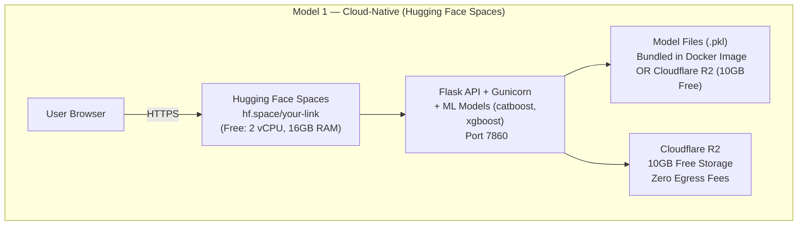
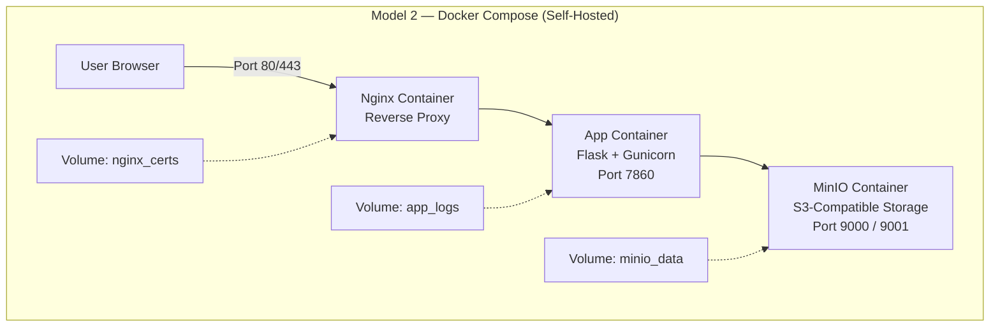

# CardioSense ML — Architecture Overview

> **DADMP v1.0 — Dual Architecture Deployment**  
> Two independent deployment tracks from a single codebase.

---

## Project Classification

| Property | Value |
|---|---|
| Language | Python 3.10 |
| Framework | Flask |
| Type | Monolith (Frontend + Backend + ML combined) |
| Entrypoint | `app.py` |
| ML Libraries | scikit-learn, xgboost, catboost, imbalanced-learn |
| Deployment Class | **Class B (Heavy ML)** — RAM > 1GB |

---

## Model 1 — Cloud-Native (Live Portfolio Link)



**Platform:** [Hugging Face Spaces](https://huggingface.co/spaces) — Docker SDK  
**Why:** Only free platform with 16GB RAM, capable of running catboost + xgboost + scikit-learn without OOM errors.  
**URL:** `https://[username]-cardiosense-ml.hf.space`

---

## Model 2 — Self-Hosted Docker Compose (Any Machine)



**How to run:**
```bash
cp infra/docker/.env.example infra/docker/.env
# Edit .env with your values
docker-compose -f infra/docker/docker-compose.yml up -d
```

**Access:**
- Application: `http://localhost:80`
- MinIO Console: `http://localhost:9001`

---

## Comparison Table

| Feature | Model 1 (HF Spaces) | Model 2 (Docker) |
|---|---|---|
| Purpose | Live portfolio link | Local / VPS / CI |
| RAM available | 16GB free | As much as your machine |
| Setup time | ~5 minutes | ~2 minutes (with Docker) |
| URL | `hf.space/...` (public) | localhost or your VPS IP |
| Database | None needed | None needed (stateless) |
| Object Storage | Cloudflare R2 | MinIO (self-hosted) |
| Cost | Free forever | Free (your machine) |

---

## Security Model

- All secrets managed via environment variables. Never in source code.
- `.env` files are gitignored. Only `.env.example` (with placeholders) is committed.
- Docker containers run as non-root user (UID 1000) in production.
- ML model weights (`.pkl`) are excluded from git and stored separately.
